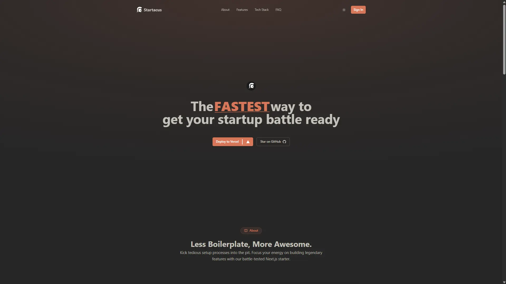

<h1 align='center'>Startacus</h1>

[](https://codetime.dev)


## Table of Contents

- [Project Overview](#project-overview)
- [Project Structure](#project-structure)
- [Available Scripts](#available-scripts)
- [Architecture Overview](#architecture-overview)
  - [Authentication](#authentication)
  - [Database](#database)

## Project Overview

Startacus is a full-stack starter kit that cuts out the boilerplate chaos so I can just code what counts. It's built on a modern stack, comes with authentication, database, UI components and state management already wired in. Everything I kept repeating from project to project, but done once, properly.

## Project Structure

```
startacus/
├── .github/                # GitHub configuration
│   └── workflows/          # CI/CD workflows
├── .husky/                 # Git hooks
├── actions/                # App actions
├── app/                    # Next.js App Router
│   ├── (auth)/             # Authentication routes
│   ├── api/                # API routes
│   │   ├── auth/           # Auth API endpoints
│   │   └── uploadthing/    # File upload API
│   ├── styles/             # Global styles
│   └── tos/                # Terms of service page
├── components/             # Reusable UI Components
│   ├── global/             # Global components
│   ├── home/               # Home page components
│   ├── profile/            # User profile components
│   └── ui/                 # UI components library
├── constants/              # Application constants
├── database/               # Database configuration
│   ├── drizzle/            # Drizzle ORM files
│   └── schema/             # Database schema definitions
├── emails/                 # Email templates
├── hooks/                  # Custom React hooks
├── lib/                    # Utility libraries
│   └── auth/               # Authentication utilities
├── providers/              # React context providers
├── public/                 # Static assets
└── config files            # Various configuration files
```

### Available Scripts

- `npm run dev` - Start development server with Turbopack
- `npm run build` - Build for production
- `npm run start` - Start production server
- `npm run lint` - Run ESLint
- `npm run typecheck` - Run TypeScript type checking
- `npm run email` - Start email preview server
- `npm run db:push` - Push schema changes to the database
- `npm run db:studio` - Open Drizzle Studio for database management

## Architecture Overview

### Authentication

The application uses Better Auth for authentication. Authentication flows include:

- Sign up with email and password
- Sign in with email and password
- Magic link authentication
- Email verification
- Password reset

Authentication logic is located in `lib/auth/` directory.

### Database

PostgreSQL is used as the database with Drizzle ORM for data modeling and queries. The database schema is defined in the `database/schema/` directory and migrations are managed with Drizzle Kit.
